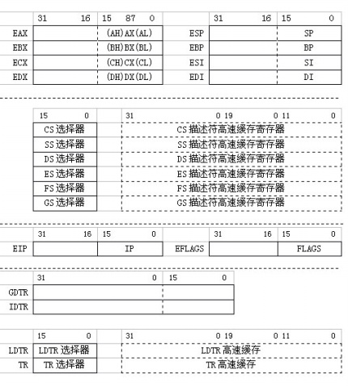
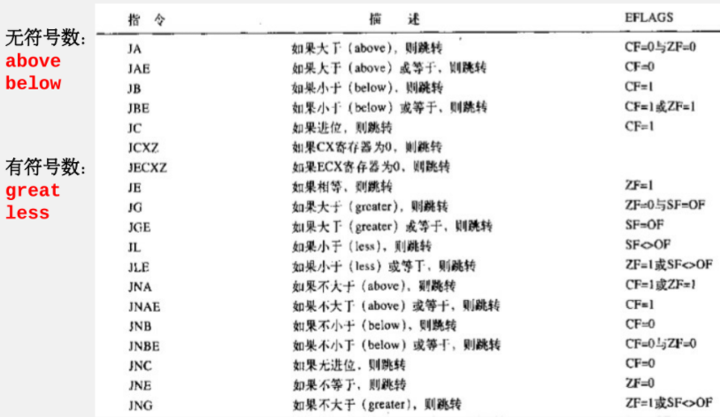
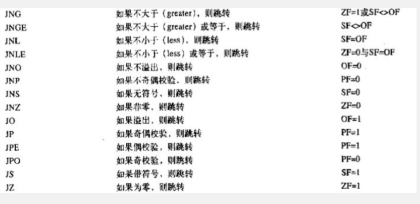
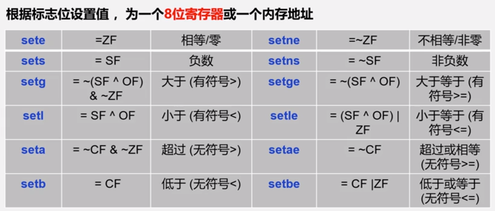
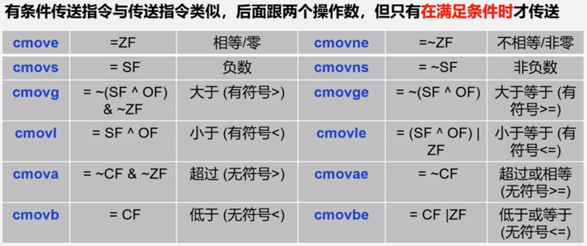
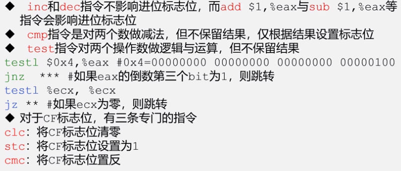

## 0、预备知识

- 以下内容均以：Intel 80386 CPU为前提
- 大端与小端：机器中储存数据的两种方式，例如十六进制数`0x0804807e`：
	- 大端：08 04 80 7e（低地址->高地址，数据的低位保存在内存的⾼地址）
	- 小端（更常见）：7e 80 04 08（低地址->高地址，数据的低位保存在内存的低地址）
		- 主要是要理解内存从低到高的方向(→)与数据从低到高的方向(←)是相反的((

## 1、寄存器（80386）

- 通用寄存器

	八个32位通用寄存器的名称如下：**EAX（累加器）、EBX（基址）、ECX（计数）、EDX（数据：整除余数）、ESP（栈指针）、EBP（基址指针）、ESI（源变址）、EDI（目的变址）**

	>  ESI与EDI共同作用拷贝字符串

- 段寄存器(CS、SS、DS、ES、FS、GS)

- 指令指针寄存器和标志寄存器(EIP、EFLAGS)

- 系统表寄存器(GDTR、IDTR、LDTR、TR)

- 控制寄存器(CR0、CR1、CR2、CR3、CR4)

- 调试寄存器(DR0、DR1、DR2、DR3、DR4、DR5、DR6、DR7)

- 测试寄存器(TR6、TR7)

	




## 2、mov指令

### 功能与格式

- mov指令用于进行在寄存器和内存之间进行数据传送
- 格式为：`mov(l/w/b) 源操作数,目的操作数`

### 传送数据至寄存器（寻址）

- **立即数寻址：`movl $1,%eax`**

	​		功能：将值``1``赋给寄存器eax

- **寄存器寻址：`movl %ebx,%eax`**

	​		功能：将寄存器ebx的值赋给eax

- **绝对寻址：`movl 0x08048054,%eax`**

	​		功能：从内存地址`0x08048054`的字节开始向高地址方向取4个字节并传送

	​		**注意：通常内存中数据显示时，低位在左，高位在右；而寄存器数据显示时正好相反**

- **间接寻址：`movl (%ebx),%eax`**

	​		功能：将寄存器ebx的值作为内存地址来进行上述绝对寻址的操作

- **基址偏移量寻址：`movl 0x8(%ebx),%eax`**

	​		功能：将寄存器ebx的值加上括号前的常量来作为内存地址

- **变址寻址：`movl (%ebx,%edx),%eax`**

	​		功能：将寄存器ebx和edx内值相加的结果来作为内存地址，常用于实现数组访问

- **变址基址寻址：`movl 0x8(%ebx,%edx),%eax`**

	​		功能：三个值相加的结果作为内存地址

- **比例变址寻址：`movl (%ebx,%ecx,0x2),%eax`**

	​		功能：ecx乘比例因子(仅能为1/2/4/8)再加上ebx的结果作为内存地址

- **比例变址基址寻址：`movl 0x8(%ebx,%ecx,0x2),%eax`**

### 传送数据至内存

- 定义变量

	```assembly
	.section .data
		value1:
			.int 1
	```

	其中`.int`表示变量占4字节，`.short`占2字节，`.byte`占1字节

	value1相当于标签，在写汇编代码时可以直接用来指代此位置地址

- 传送数据

	只需将value1看作对应变量的内存地址即可

	```assembly
	movl %ecx,value1
	movl value1(,%ecx,1),%edx
	```

- 变量取址

  - 通过`$`将其作为数值来取址：

  	```assembly
  	 movl $value1,%edi
  	```

  - 或者通过lea指令放入寄存器中：

  	```assembly
  	leal value1,%esi
  	```

  	- 关于lea的奇妙代码

  		```assembly
  		#eax = 3*edx+5
  		leal 5(%edx, %edx, 2), %eax
  		```

- 后缀l/w/b分别表示传送字长为32/16/8
	- 若不加后缀，则向寄存器传输值时默认为寄存器大小
	- 如果源数据长度超过传送字长，则截取源数据低位传送

## 3、栈操作指令

- **栈的定义：**于数据结构中的栈类似，都有先进后出（FIFO）的特性

	- **栈顶：** 其指针保存于%esp中，当压栈时，**栈顶向低地址方向增长**

- **操作指令：**

	```assembly
	pushl $2
	#相当于执行了：
	#	sub %esp, $4
	#	movl $2, (%esp)
	popl %eax
	#相当于执行了：
	#	movl (%esp), %eax
	#	add %esp, $4
	```

## 4、算术逻辑操作指令

- **一般算术逻辑指令**

	|   指令    | 功能  |   指令   | 功能  | 指令 |   功能   |
| :-------: | :---: | :------: | :---: | :--: | :------: |
|   incl    | 自加1 |   ecl    | 自减1 | SHR  | 逻辑右移 |
|   negl    | 取负  |   notl   | 取反  | SHL  | 逻辑左移 |
|  al S,D   |  加   | subl S,D |  减   | SHA  | 算术右移 |
| imull S,D |  乘   | xorl S,D | 异或  | SAL  | 算术左移 |
|  orl S,D  |  或   | anl S,D  |  与   |      |          |

- **特殊算术指令**

	| 指令    | 功能                                                       |
| ------- | ---------------------------------------------------------- |
	| imull S | 有符号乘法——S与eax相乘，64位结果，高32位放edx，低32位放eax |
	| mull S  | 无符号乘法——S与eax相乘，64位结果，高32位放edx，低32位放eax |
	| clt S   | 将eax值符号位扩展至64位，高32位放edx，低32位放eax          |
	| iivl S  | 有符号除法—— **edx = edx:eax % S** ；**eax = edx:eax / S** |
	| ivl S   | 无符号除法—— **edx = edx:eax % S** ；**eax = edx:eax / S** |

## 5、跳转指令

- **eip寄存器**：存放下一条要执行指令的地址，只能通过跳转指令修改

- **直接跳转指令：jmp**

	jmp指令有以下4种使用方式：

	1. **`jmp lable`**
		- 该指令长度仅为2字节，因此**只能前后跳转127字节**，其中第二个字节指示了跳转方向和长度
	2. **`jmp 0x0804909a`**
		- 该指令长度为5字节，后4字节指示与当前地址的**相对距离**
	3. **`jmp *%eax`**
		- 该指令长度仅为2字节，相当于指令`movl %eax %eip`
	4. **`jmp *lable`**
		- 该指令长度为6字节，后4位为目的位置的**绝对地址**

- **eflags寄存器**：储存了条件跳转所需的条件数据，以下是常用的几个条件

	| 条件(位置) |                     功能                     |
	| :--------: | :------------------------------------------: |
	|   CF(0)    |         进位/借位（无符号减法）标志          |
	|   PF(2)    | 奇偶标志（如果进行奇偶校验且结果为偶为PF=1） |
	|   ZF(6)    |            零标志（结果为0时为1）            |
	|   SF(7)    |            符号标志（结果第一位）            |
	|   OF(11)   |        溢出标志（最高位和溢出位异或）        |

- **cmp指令：**`cmp %eax,%ebx`等效于进行ebx-eax运算并设置标志位

- **条件跳转指令：**

  

  

  

- **标志位指令：**

	

- **条件mov指令：**

	

- **条件相关细节：**

	

## 6、循环指令

- **loop指令：**

	- 格式：`loop 标签`

	- 功能：**先使ecx自减1**，然后判断ecx是否为0，如果不是0则跳转至标签处
		- 注意ecx的值应当**大于等于1**

